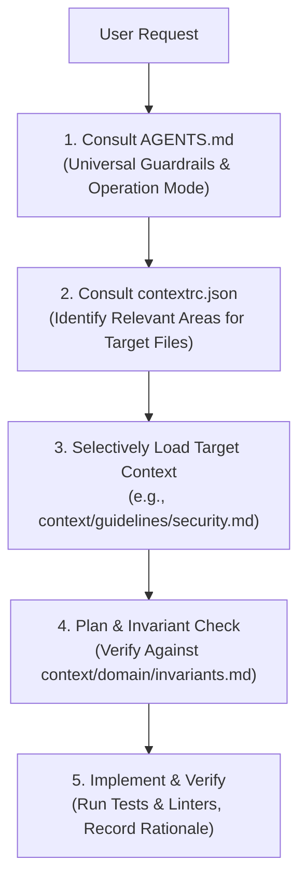

# AI Context Engineering & Project Setup Template

[](#context-health--integrity-checks)
[](./LICENSE)
[](#multi-tool-compatibility)

A clean, technology-agnostic baseline for setting up software projects for **AI coding agents** and human-AI developer collaboration.

This template eliminates the friction of configuring AI agents by providing **canonical guardrails**, **layered context architecture**, **declarative context routing**, **specification-driven development templates**, and **cross-platform validation tools**.

---

## 🚀 60-Second Quick Start

### 1. Copy Template into Your Repository
Copy this template into the root of your new or existing software project:

```bash
# Option A: Clone as a new project
git clone https://github.com/your-org/ai-context-template.git my-awesome-project
cd my-awesome-project

# Option B: Copy into an existing repository
cp -R /path/to/ai-context-template/* /path/to/my-existing-project/
```

### 2. Run the Initialization Script
Run the interactive onboarding script to configure project metadata:

**PowerShell (Windows / Azure DevOps / Cross-platform):**
```powershell
pwsh ./scripts/init-project.ps1
```

**Bash (Linux / macOS):**
```bash
chmod +x ./scripts/*.sh
./scripts/init-project.sh
```

The script will prompt for your project name, description, and primary tech stack, automatically updating [`contextrc.json`](./contextrc.json) and [`CLAUDE.md`](./CLAUDE.md).

### 3. Verify Context Integrity
Run the context health validator to verify that all links and references are valid:

```powershell
pwsh ./scripts/validate-context.ps1
```

You are now ready to code with any AI coding agent!

---

## 🧠 Why Context Engineering?

Modern AI coding agents (GitHub Copilot, Cursor, Claude Code, Antigravity) are powerful, but without structured context they suffer from common failure modes:
1. **Context Window Exhaustion**: Feeding entire codebases into prompts wastes tokens and dilutes attention.
2. **Reinventing the Wheel**: Agents author duplicate helper utilities because they don't know existing ones exist.
3. **Invariant Violations**: Agents write insecure or un-scoped queries (e.g., forgetting multi-tenant filters).
4. **Instruction Drift**: Maintaining separate, out-of-sync prompt instructions across different AI tools.

This template solves these problems by establishing a **single canonical source of truth** (`AGENTS.md`) and a **declarative context routing mechanism** (`contextrc.json`).

---

## 📁 Repository & Directory Layout

```text
├── .ai/                              # Ephemeral scratchpad (git-ignored: patches, diffs, temp notes)
├── .cursor/
│   └── rules/project-rules.mdc       # Native Cursor IDE modular rule definition
├── .github/
│   ├── agents/                       # Specialized agent personas (Architect, Reviewer, Security, QA)
│   ├── prompts/                      # Structured prompts (PR review, ADR creation, spec generation, tests)
│   └── copilot-instructions.md       # GitHub Copilot entrypoint delegating to AGENTS.md
├── .vscode/
│   ├── mcp.json.example              # Model Context Protocol (MCP) server configuration template
│   └── settings.json                 # Recommended editor settings & terminal auto-approvals
├── context/
│   ├── architecture/                 # System topology, module boundaries, data flows (with Mermaid)
│   │   ├── overview.md
│   │   └── boundaries.md
│   ├── decisions/                    # Architecture Decision Records (ADRs)
│   │   ├── adr.template.md
│   │   └── 0001-record-architecture-decisions.md
│   ├── domain/                       # Ubiquitous language dictionary & non-negotiable invariants
│   │   ├── glossary.md
│   │   └── invariants.md
│   ├── guidelines/                   # Concrete engineering standards with code examples
│   │   ├── coding-standards.md
│   │   ├── testing.md
│   │   └── security.md
│   ├── schemas/                      # JSON schemas for configuration validation
│   │   └── contextrc.schema.json
│   └── specs/                        # Spec-driven development templates
│       ├── spec.template.md          # Feature specification (User story, criteria, scope)
│       ├── plan.template.md          # Phased technical implementation plan & risk mitigations
│       ├── tasks.template.md         # Actionable step-by-step task checklist
│       └── checklist.template.md     # Pre-merge quality & verification checklist
├── scripts/                          # Portable cross-platform automation tools
│   ├── init-project.ps1 / .sh        # Interactive onboarding script
│   ├── validate-context.ps1 / .sh    # Context health & link integrity validator
│   └── generate-repo-map.ps1 / .sh   # Token-efficient repository tree generator
├── .cursorrules                      # Legacy Cursor IDE rule connector
├── .gitignore                        # Standard repository hygiene & ephemeral directory exclusion
├── AGENTS.md                         # Universal, canonical instruction set & project constitution
├── CLAUDE.md                         # Claude Code CLI entrypoint delegating to AGENTS.md
├── contextrc.json                    # Declarative context routing manifest
├── LICENSE                           # Open source MIT License
└── README.md                         # This comprehensive guide
```

---

## 🔍 Directory Purpose & Ownership Matrix

| Folder / File | Purpose | Who Edits? | Mandatory? | Maintenance Cadence |
| :--- | :--- | :--- | :--- | :--- |
| **[`AGENTS.md`](./AGENTS.md)** | Core project constitution, invariants, and agent behavior rules. | Humans | **Mandatory** | Rare (when core policies change). |
| **[`contextrc.json`](./contextrc.json)** | Maps file path globs to relevant context documentation. | Humans & AI | **Mandatory** | When adding new modules/subsystems. |
| **`context/architecture/`** | System topology, sequence flows, and integration boundaries. | Humans & AI | Recommended | When system design evolves. |
| **`context/domain/`** | Domain terms, abbreviations, and non-negotiable business rules. | Humans & AI | Recommended | Ongoing as domain vocabulary grows. |
| **`context/guidelines/`** | Coding style, error handling, security, and testing policies. | Humans | Recommended | Periodic review during tech retro. |
| **`context/decisions/`** | Immutable history of major architectural trade-offs. | Humans & AI | Recommended | Created whenever an ADR is approved. |
| **`context/specs/`** | Feature specifications, implementation plans, and checklists. | Humans & AI | Optional | Per non-trivial feature or epic. |
| **`.ai/`** | Ephemeral scratchpad for git diffs, review drafts, and temp logs. | AI Agents | Ephemeral | Automatic (git-ignored). |

---

## 🧭 How AI Agents Navigate This System

When an agent is assigned a task, it follows a 5-stage discovery protocol:



1. **Root Directives**: Reads [`AGENTS.md`](./AGENTS.md) to discover security rules, code reuse expectations, and operation mode (Read-Only vs. Build).
2. **Context Routing**: Consults [`contextrc.json`](./contextrc.json) with the paths of files it plans to touch (e.g. `src/auth/*` $\rightarrow$ loads `context/guidelines/security.md` and `context/domain/invariants.md`).
3. **Selective Reading**: Loads only the specific architectural documents needed for the task, keeping token usage minimal.
4. **Plan Formulation**: Formulates an incremental plan conforming to the project's invariants (e.g., verifying multi-tenant query filters and error formatting).
5. **Execution & Verification**: Applies changes cleanly, runs tests, and explains modifications.

---

## ⚡ Multi-Tool Compatibility Guide

No vendor lock-in. All major tools are wired back to the canonical [`AGENTS.md`](./AGENTS.md):

- **GitHub Copilot**: Reads [`.github/copilot-instructions.md`](./.github/copilot-instructions.md) automatically in Chat, Copilot Edits, and Copilot Workspace.
- **Claude Code**: Reads [`CLAUDE.md`](./CLAUDE.md) upon startup in the terminal.
- **Cursor IDE**: Reads [`.cursorrules`](./.cursorrules) and [`.cursor/rules/project-rules.mdc`](./.cursor/rules/project-rules.mdc).
- **Google Antigravity / Gemini Agents**: Reads [`AGENTS.md`](./AGENTS.md) natively.
- **Model Context Protocol (MCP)**: Use [`.vscode/mcp.json.example`](./.vscode/mcp.json.example) to securely configure database inspectors, GitHub tool servers, or custom APIs.

---

## 📌 Persistent vs. Ephemeral Context

| Context Category | Where It Lives | Committed to Git? | Examples |
| :--- | :--- | :--- | :--- |
| **Persistent Context** | `context/`, `AGENTS.md`, `contextrc.json` | **YES** | System architecture, domain invariants, coding standards, approved ADRs. |
| **Ephemeral Context** | `.ai/` | **NO** (Git-ignored) | `diff.patch`, `pr.json`, scratchpad notes, raw LLM token outputs. |

> **Rule for Agents**: Never commit temporary review logs, conversation summaries, or scratch notes to persistent documentation folders. Keep runtime scratch files in `.ai/`.

---

## 🛠 Context Health & Integrity Checks

Ensure your context documentation never rots or breaks by running the included health check tool:

```powershell
pwsh ./scripts/validate-context.ps1
```

This verifies:
- Syntax and schema validation of [`contextrc.json`](./contextrc.json).
- Existence of all files referenced in `contextrc.json`.
- Zero broken relative markdown links across all `.md` files.
- Presence of all canonical tool connectors (`AGENTS.md`, `CLAUDE.md`, etc.).

---

## ❓ Troubleshooting & Common Pitfalls

- **Problem: Agent generates code from scratch instead of reusing existing utilities.**
  *Fix*: Ensure [`AGENTS.md`](./AGENTS.md) Rule 2 is active. Instruct the agent to run a code search before generating helper functions.
- **Problem: Agent context window gets overloaded with unrelated files.**
  *Fix*: Check [`contextrc.json`](./contextrc.json). Ensure file glob patterns (`applyTo`) are granular so only relevant docs are loaded.
- **Problem: AI agents make unauthorized changes when investigating bugs.**
  *Fix*: Remind the agent to operate in **Strict Read-Only Mode** until you explicitly approve the implementation plan.

---

## 📄 License

This project is licensed under the [GNU License](./LICENSE). Feel free to use and adapt it for personal, open-source, or commercial software projects.
