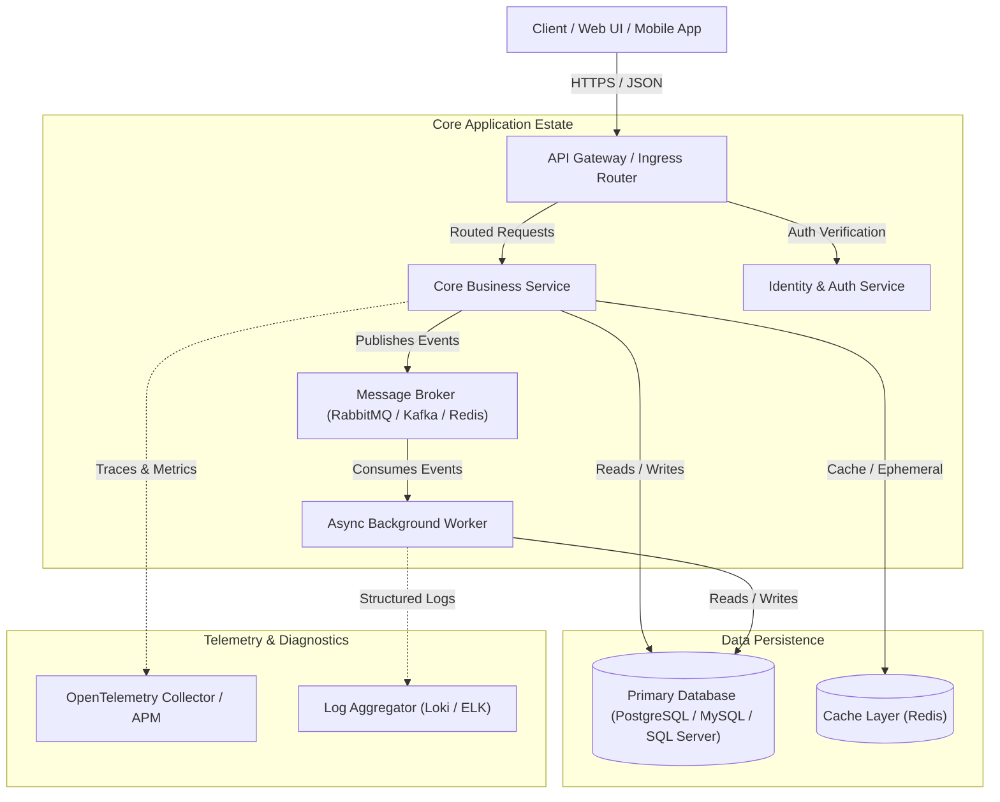
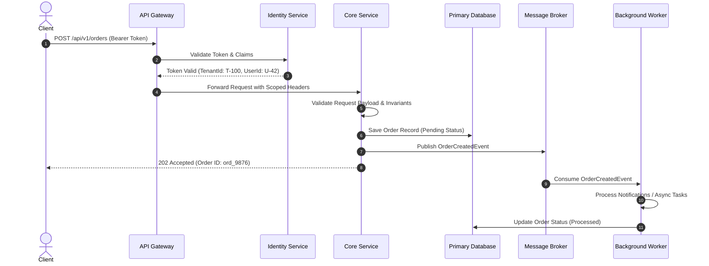

# System Architecture Overview

> **Agent Instruction**: Read this document first when onboarding to the project or planning changes that span multiple modules or services.

## 1. System Mission & Context

This system is designed as a modular service-oriented application. The high-level objective of the system is to provide reliable, scalable, and observable domain operations.

### High-Level Topology

---

## 2. Component Directory & Responsibilities

| Component | Responsibility | Technology Stack / Patterns | Context Link |
| :--- | :--- | :--- | :--- |
| **API Gateway** | Request routing, rate-limiting, SSL termination, and client token inspection. | Reverse Proxy / Gateway | [`context/architecture/boundaries.md`](./boundaries.md) |
| **Identity / Auth** | User authentication, token issuance, permission resolution, and session management. | JWT / OIDC / OAuth2 | [`context/guidelines/security.md`](../guidelines/security.md) |
| **Core Service** | Core business domain logic, workflows, transactional data storage. | REST / gRPC, Domain-Driven Design | [`context/domain/invariants.md`](../domain/invariants.md) |
| **Async Worker** | Background jobs, long-running processes, email dispatch, data synchronization. | Queue Consumer, Idempotent Processing | [`context/guidelines/coding-standards.md`](../guidelines/coding-standards.md) |
| **Database** | Relational source of truth, schema migrations, transactional guarantees. | Relational DB + Migration Engine | [`context/domain/glossary.md`](../domain/glossary.md) |

---

## 3. Core Data Flow Example

### Example: Processing a User Order / Domain Action

---

## 4. Key Architectural Patterns

1. **Explicit Scoping**:
   - Every request and event carries tenant, user, and correlation context.
   - Cross-tenant data leakage is strictly forbidden.

2. **Idempotency & Safe Retries**:
   - Background event processing must be idempotent.
   - Use idempotency keys or unique event IDs to prevent duplicate processing.

3. **Separation of Contracts**:
   - API request/response DTOs must remain decoupled from internal database entities.
   - Changes to public API contracts must be versioned and backward-compatible.
